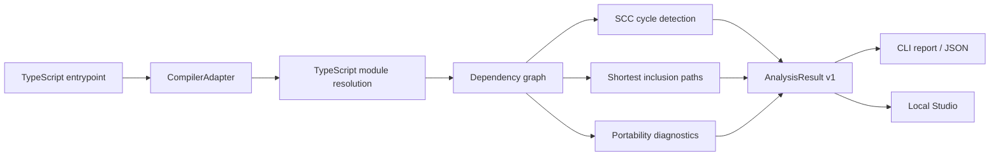

<h1 align="center">
  
  CodeLift
</h1>

<p align="center">
  <strong>Understand what a TypeScript module carries before you extract it.</strong>
</p>

<p align="center">
  CodeLift builds an explainable dependency graph from one TypeScript entrypoint,<br />
  entirely on your machine and without changing or executing the source project.
</p>

<p align="center">
  
  
  
  
</p>

> [!IMPORTANT]
> CodeLift is currently an analysis-only alpha. It shows the dependency boundary and portability
> risks of a module, but it does not yet generate a package, rewrite imports, or run verification.
> The packages in this repository are not published to npm yet.

## Contents

- [Why CodeLift?](#why-codelift)
- [What works today](#what-works-today)
- [Requirements](#requirements)
- [Quick start](#quick-start)
- [CLI reference](#cli-reference)
- [How analysis works](#how-analysis-works)
- [Programmatic API](#programmatic-api)
- [Diagnostics](#diagnostics)
- [Privacy and security](#privacy-and-security)
- [Architecture](#architecture)
- [Development](#development)
- [Roadmap](#roadmap)
- [Contributing](#contributing)

## Why CodeLift?

Moving a useful module into its own package often looks simple until transitive imports, aliases,
cycles, environment reads, or hidden filesystem assumptions appear. CodeLift makes that boundary
visible before any files are moved.

Starting from a single entrypoint, CodeLift answers:

- Which local files would need to move with it?
- Which npm packages and Node.js built-ins does it depend on?
- Why was a particular file included?
- Are there dependency cycles?
- Which exact import statement created each edge?
- Which dependencies or runtime assumptions make extraction unsafe?

The same analysis engine powers both the CLI and the browser-based Studio, so both surfaces return
the same versioned `AnalysisResult`.

## What works today

| Capability | Status |
| --- | --- |
| One `.ts` or `.mts` entrypoint | Supported |
| Node.js ESM with `NodeNext` | Supported |
| Relative imports and TypeScript `paths` aliases | Supported |
| Re-exports and type-only imports | Supported |
| Literal `import("...")` | Supported |
| Node.js built-ins and npm package subpaths | Supported |
| Dependency cycles and shortest inclusion paths | Supported |
| Import source text with line and column evidence | Supported |
| `process.env`, relative file reads, and `globalThis` heuristics | Supported |
| CommonJS, `require()`, TSX, and assets | Diagnosed, not followed |
| Package generation and import rewriting | Planned |
| Isolated verification of an extracted package | Planned |

CodeLift deliberately reports unsupported behavior instead of guessing. The current profile covers
one project root, one `tsconfig`, and one entrypoint. Multi-entry packages, monorepo/workspace
boundaries, React/TSX, CSS and other assets, and complete ambient dependency tracing are outside the
first increment.

## Requirements

- **Node.js 24 or newer.** Node.js 24 LTS is the recommended and CI-tested runtime. Newer versions
  are accepted with a warning.
- **pnpm 12.4.x.** The exact workspace package-manager version is recorded in `package.json`.
- A project using `module: "NodeNext"` and `moduleResolution: "NodeNext"` in its selected
  `tsconfig`.

The included `.nvmrc` selects the recommended Node.js release when using `nvm`. On newer Node.js
versions, installation prints a support notice and continues.

## Quick start

CodeLift currently runs from a source checkout:

```bash
cd CodeLift

# Optional when nvm is installed; selects Node.js 24 LTS.
nvm use

pnpm install
pnpm build
```

Analyze the included demonstration fixture:

```bash
pnpm codelift inspect src/index.ts \
  --project fixtures/node-esm-basic \
  --tsconfig tsconfig.json
```

Start Studio for the same fixture:

```bash
pnpm codelift studio \
  --project fixtures/node-esm-basic \
  --tsconfig tsconfig.json \
  --entry src/index.ts
```

The CLI opens Studio in the default browser. The server chooses an available local port and prints
the full session URL. Press <kbd>Ctrl</kbd> + <kbd>C</kbd> to stop it.

## CLI reference

### Inspect an entrypoint

```text
codelift inspect <entry> --project <root> --tsconfig <path> [--format pretty|json]
```

When running from this repository, prefix the command with `pnpm`:

```bash
pnpm codelift inspect src/public-api.ts \
  --project /absolute/path/to/project \
  --tsconfig tsconfig.json
```

Arguments and options:

| Argument or option | Meaning |
| --- | --- |
| `<entry>` | Entrypoint path relative to the project root |
| `--project <root>` | Root directory CodeLift is allowed to inspect |
| `--tsconfig <path>` | TypeScript configuration, normally relative to the project root |
| `--format pretty` | Human-readable report; this is the default |
| `--format json` | Complete, versioned `AnalysisResult` for scripts and integrations |

Example JSON export:

```bash
pnpm codelift inspect src/index.ts \
  --project /path/to/project \
  --tsconfig tsconfig.json \
  --format json > codelift-analysis.json
```

Exit codes are stable and suitable for CI:

| Code | Meaning |
| ---: | --- |
| `0` | Analysis completed without blocking issues |
| `1` | Analysis completed and found at least one blocking issue |
| `2` | Invalid arguments, configuration error, or runtime failure |

Warnings such as environment reads do not change the exit code to `1`; only issues marked as
blocking do.

### Start Studio

```text
codelift studio --project <root> [--tsconfig <path>] [--entry <path>]
                [--port <number>] [--no-open]
```

| Option | Meaning |
| --- | --- |
| `--project <root>` | Required filesystem boundary for the Studio session |
| `--tsconfig <path>` | Initially selected TypeScript configuration |
| `--entry <path>` | Initially selected entrypoint |
| `--port <number>` | Loopback port; defaults to `0`, which selects an available port |
| `--no-open` | Start the server without opening a browser |

Studio contains four working areas:

1. The top bar selects the `tsconfig` and starts an analysis.
2. The left panel selects an entrypoint and lists included files and external packages.
3. The center canvas displays the directed graph with pan, zoom, and automatic Dagre layout.
4. The right panel explains why a node was included, shows exact import evidence and issues, and
   opens a read-only source preview.

The status bar reports the actual number of files, packages, cycles, and issues in the latest
analysis.

## How analysis works



Local source files are traversed transitively. External npm packages and Node.js built-ins become
leaf nodes and are not inspected. Collections and IDs are deterministic, while source paths in the
result are normalized relative to the project root.

### Graph vocabulary

Node kinds:

- `local-file` — a source file included in the transitive dependency set;
- `external-package` — an npm package root, including scoped packages and subpath imports;
- `node-builtin` — a Node.js standard-library module;
- `unresolved` — an import CodeLift could not safely resolve or include.

Edge kinds:

- `static-import`;
- `re-export`;
- `type-only`;
- `literal-dynamic-import`.

Every edge records its module specifier, original source text, and one-based source location. Every
reachable node receives a shortest `reasons` path from the entrypoint.

## Programmatic API

The core API is available to workspace packages and will become the basis of the future published
package:

```ts
import { analyzeProject } from "@codelift/core";

const controller = new AbortController();

const result = await analyzeProject(
  {
    projectRoot: "/absolute/path/to/project",
    tsconfigPath: "tsconfig.json",
    entrypoint: "src/index.ts",
  },
  controller.signal,
);

console.log(result.nodes);
console.log(result.cycles);
console.log(result.reasons);
```

The public contract is:

```ts
analyzeProject(request: AnalysisRequest, signal?: AbortSignal): Promise<AnalysisResult>
```

`AnalysisResult` includes a schema version, project metadata, nodes, edges, issues, strongly
connected cycles, external packages, inclusion reasons, and summary statistics. See
[`packages/core/src/types.ts`](packages/core/src/types.ts) for the complete type definitions.

## Diagnostics

Blocking diagnostics mean CodeLift cannot describe a safe, complete extraction boundary. Warnings
identify dependencies that may need explicit configuration or manual migration.

| Code | Level | Meaning |
| --- | --- | --- |
| `CL001` | Error | The selected TypeScript configuration is not `NodeNext` |
| `CL002` | Error | A resolved local dependency has an unsupported file type |
| `CL003` | Error | A local import could not be resolved |
| `CL004` | Error | An import resolves outside the selected project root |
| `CL005` | Error | A dynamic import does not use a string literal |
| `CL006` | Error | CommonJS `require()` or import assignment was found |
| `CL007` | Warning | Relative filesystem access may depend on the working directory |
| `CL008` | Warning | The module reads from `process.env` |
| `CL009` | Warning | The module reads from `globalThis` |
| `CL010` | Error | An asset import is unsupported |
| `CL012` | Error | TypeScript could not load a source file |

Configuration and invocation failures use descriptive codes such as `PATH_OUTSIDE_PROJECT`,
`PROJECT_PATH_NOT_FOUND`, and `ENTRYPOINT_UNSUPPORTED` and produce CLI exit code `2`.

## Privacy and security

CodeLift is local by design:

- analyzed source code is never uploaded;
- source files are opened read-only and are never rewritten;
- imported modules and project scripts are never executed;
- dependencies are never installed on behalf of the analyzed project;
- Studio binds only to `127.0.0.1` by default;
- every Studio API request requires a random per-session token;
- cross-origin API requests are rejected and CORS is not enabled;
- `realpath` checks prevent path traversal and symlink escapes from the selected project root;
- source preview is restricted to files inside that root and files larger than 1 MB are rejected.

See [`SECURITY.md`](SECURITY.md) for vulnerability reporting guidance.

## Architecture

CodeLift is a pnpm workspace with a single analysis engine and two delivery surfaces:

```text
CLI ─────────────────┐
                     ├── @codelift/core ── CompilerAdapter ── TypeScript 6 compatibility API
Local Studio API ────┘
        │
        └── React Studio
```

| Path | Responsibility |
| --- | --- |
| `packages/core` | Project loading, module resolution, scanning, graph algorithms, and result types |
| `packages/cli` | `inspect` and `studio` commands plus terminal/JSON rendering |
| `packages/studio-server` | Token-protected, loopback-only Fastify API and static Studio host |
| `apps/studio` | React 19 interface, React Flow graph, and Dagre layout |
| `fixtures` | Deterministic projects for golden, CLI, API, and browser tests |
| `docs` | Architecture notes and project assets |

CodeLift itself is built with TypeScript 7. Project analysis currently uses the TypeScript 6
compatibility API behind `CompilerAdapter`, keeping the compiler integration replaceable when the
new Compiler API is available.

More detail is available in [`docs/architecture.md`](docs/architecture.md). The original product
scope and design rationale live in [`CodeLift.md`](CodeLift.md).

## Development

Install dependencies and build all workspace packages before invoking the CLI:

```bash
pnpm install
pnpm build
```

Useful commands:

| Command | Purpose |
| --- | --- |
| `pnpm dev` | Run the Studio API and Vite development server together |
| `pnpm lint` | Check source, configuration, and documentation formatting with Biome |
| `pnpm lint:fix` | Apply safe Biome formatting and lint fixes |
| `pnpm typecheck` | Type-check all workspace packages |
| `pnpm test` | Run core, CLI, API, and React unit/integration tests |
| `pnpm test:e2e` | Run the Playwright Studio workflow |
| `pnpm build` | Build every package and the production Studio bundle |
| `pnpm ci` | Run lint, typecheck, tests, and build in sequence |

For live Studio development:

```bash
pnpm dev
```

Then open <http://127.0.0.1:5173/#token=dev-token>. The development API analyzes
`fixtures/node-esm-basic` and listens on port `4317`.

GitHub Actions validates the project on Ubuntu, macOS, and Windows with Node.js 24. The browser
workflow runs separately on Chromium.

## Roadmap

- [x] Versioned dependency analysis for one TypeScript entrypoint
- [x] Explainable graph, cycle detection, import evidence, and issue reporting
- [x] CLI and local read-only Studio
- [ ] Versioned extraction plan
- [ ] Safe package exporter and import rewriting
- [ ] Isolated build and test verification
- [ ] Multiple entrypoints and broader TypeScript project profiles

Graph correctness is intentionally being validated before CodeLift starts writing files.

## Contributing

Issues and focused pull requests are welcome. Before submitting a change, run:

```bash
pnpm lint
pnpm typecheck
pnpm test
pnpm build
```

Changes to analysis behavior should include a focused fixture or test and preserve deterministic
output. Security-sensitive path handling should include both a valid in-root case and an attempted
escape.

## License

CodeLift is released under the [MIT License](LICENSE).
