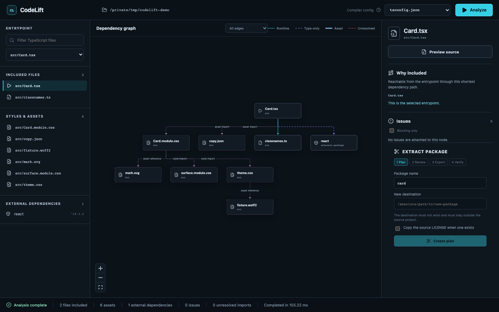

<h1 align="center">
  
  CodeLift
</h1>

<p align="center">
  <strong>Understand, extract, and verify a TypeScript or React module.</strong>
</p>

<p align="center">
  CodeLift traces everything reachable from one entrypoint, lets you review an immutable
  extraction plan, creates a standalone source package, and verifies it without changing the
  original project.
</p>

<p align="center">
  
  <a href="https://www.npmjs.com/package/codelift-cli"></a>
  
  
</p>

> [!IMPORTANT]
> CodeLift is beta software. The current release is
> [`codelift-cli@0.4.0-beta.0`](https://www.npmjs.com/package/codelift-cli). Use the `beta` dist-tag
> until the first stable release.



## What CodeLift does

Starting with one `.ts`, `.mts`, or `.tsx` entrypoint, CodeLift:

- builds an explainable dependency graph with exact import locations;
- follows relative imports, TypeScript path aliases, re-exports, type-only imports, and literal
  dynamic imports;
- understands Node built-ins, npm subpaths, TSX, CSS/CSS Modules, JSON, SVG, images, and fonts;
- detects cycles, unresolved imports, environment reads, global state, and portability risks;
- creates a deterministic, digest-protected extraction plan;
- copies sources into a new package and rewrites only module specifiers;
- generates package metadata and TypeScript or Vite library build configuration;
- verifies structure without installing anything, or builds in an isolated copy after approval.

The source project is always read-only. Export is allowed only to a new directory outside the
source project.

## Fastest start

Open a terminal in the project you want to inspect:

```bash
cd /path/to/your-project
npx codelift-cli@beta
```

That command starts the local Studio, selects the current directory as the project root, chooses a
single unambiguous `tsconfig`, and opens the browser. Nothing is installed globally.

Useful short forms:

```bash
npx codelift-cli@beta ./another-project       # Studio for another project
npx codelift-cli@beta src/index.ts            # Studio with this entrypoint selected
npx codelift-cli@beta inspect src/index.ts    # report in the terminal
```

If several TypeScript configurations can own the entrypoint, CodeLift does not guess. Studio asks
you to select one; terminal commands print the candidates and exit with code `2`.

## Run from source

Requirements:

- Node.js `>=24`; Node 24 LTS is the CI baseline, newer releases are accepted;
- pnpm 12.4 for workspace development only.

If `pnpm` is not installed, use npm to invoke the pinned pnpm version:

```bash
cd /path/to/CodeLift
npx pnpm@12.4.0 install
npx pnpm@12.4.0 demo
```

Once pnpm is installed, the same workflow is shorter:

```bash
pnpm install
pnpm demo
```

`pnpm demo` builds CodeLift and opens Studio on the included Node fixture. To open Studio for the
current directory, run:

```bash
pnpm start
```

To use this checkout against another project without changing directories:

```bash
pnpm build
node packages/cli/dist/bin.js /absolute/path/to/project
```

## Diagnose a project

`doctor` checks the local runtime and project discovery without installing dependencies, executing
project scripts, or changing source files:

```bash
codelift doctor
codelift doctor ./another-project --entry src/index.ts
codelift doctor --entry src/Card.tsx --tsconfig tsconfig.json --format json
```

Exit code `0` means the project is ready for analysis, `1` means a compatibility or ambiguity issue
needs attention, and `2` means the diagnostic itself could not run.

## CLI workflow

### Analyze

```bash
codelift inspect src/index.ts
codelift inspect src/index.ts --format json
```

Project root defaults to the current directory and `tsconfig` is discovered automatically. Advanced
overrides remain available:

```bash
codelift inspect src/index.ts \
  --project /path/to/project \
  --tsconfig tsconfig.library.json \
  --format pretty
```

Exit codes:

| Code | Meaning |
| ---: | --- |
| `0` | Operation completed without blocking issues |
| `1` | Analysis or plan completed with blocking issues, or verification failed |
| `2` | Invalid arguments, ambiguous configuration, or execution error |

### Create a plan

The destination is intentionally required and is never invented by CodeLift:

```bash
codelift plan src/index.ts \
  --name invoice-kit \
  --out ../invoice-kit \
  --save codelift.plan.json
```

The versioned plan records:

- the selected profile, entrypoint, configuration, and source snapshot digest;
- SHA-256 digests of included source files and assets;
- source-to-destination mappings and planned import rewrites;
- dependency classification and exact source ranges;
- blocking issues, warnings, and accepted warnings;
- the complete expected output-file manifest.

Warnings require explicit acceptance with `--accept-warnings`. Blocking issues cannot be bypassed.
Any input change makes the plan stale and prevents export.

### Export

```bash
codelift extract --plan codelift.plan.json
```

Export requires a non-existing destination outside the source project. CodeLift writes into a
temporary sibling directory, validates the complete result, and atomically renames it into place.
If export fails or is cancelled, the staging directory is removed and no final package appears.

Generated packages are private by default and include editable source, build configuration,
`package.json`, README, and `codelift-report.json`. A source license is copied only when explicitly
requested through the programmatic plan API.

### Verify

Safe structural checks do not require network access:

```bash
codelift verify ../invoice-kit
```

This checks the plan manifest, local import resolution, package exports, public types, unexpected
files, and absolute references back to the source project. Install/build/smoke checks are reported
as `not-run`, never silently presented as passed.

To test a real isolated build:

```bash
codelift verify ../invoice-kit --install
```

CodeLift shows this choice explicitly in Studio. It copies the package to a temporary directory,
runs `npm install --ignore-scripts`, and executes only CodeLift-generated build and smoke commands.
Dependency lifecycle scripts remain disabled unless `--allow-install-scripts` is also supplied.

## Studio workflow

Studio guides the operation through:

```text
Project → Analyze → Plan → Review → Export → Verify → Report
```

- The top bar shows the filesystem root and explains what the Compiler config controls.
- The left panel selects the entrypoint and separates source files, assets, and external packages.
- The graph distinguishes source, asset, package, built-in, and unresolved nodes.
- The inspector shows the shortest “why included” path, exact import evidence, diagnostics, and a
  read-only preview for text sources.
- The extraction panel requires a package name and an explicit destination, then shows planned files
  and import rewrites before any write occurs.
- Export requires typing the package name exactly.
- Verify reports every check as `passed`, `failed`, `not-run`, `unsupported`, or `cancelled`.

Long export and verification operations are cancellable jobs. Every job is bound to the Studio
session token, source project, plan digest, and destination.

## Supported profiles

| Capability | `node-esm` | `react-library` |
| --- | :---: | :---: |
| `.ts` / `.mts` | ✓ | ✓ |
| `.tsx` and standard React JSX modes | — | ✓ |
| CSS and CSS Modules | — | ✓ |
| JSON and SVG | — | ✓ |
| PNG, JPEG, WebP, GIF, AVIF, ICO | — | ✓ |
| WOFF/WOFF2, TTF, OTF | — | ✓ |
| TypeScript `paths` aliases | ✓ | ✓ |
| Node built-ins | ✓ | Diagnosed when present |
| Package build | TypeScript | Vite library mode + declarations |

React and React DOM are classified as both peer dependencies and development dependencies. Other
runtime imports become dependencies. Ranges come from the source manifest; CodeLift never replaces
them with `latest`.

Not yet supported: CommonJS, Sass/Less, React Native, custom bundler loaders/plugins, multiple
entrypoints, project references, workspace package transfer, and automatic test migration.

## Programmatic API

The deterministic core API keeps project discovery out of `analyzeProject` itself:

```ts
import {
  analyzeProject,
  createExtractionPlan,
  exportPackage,
  verifyPackage,
} from "codelift-cli/core";

const analysis = await analyzeProject({
  projectRoot: "/absolute/project",
  tsconfigPath: "tsconfig.json",
  entrypoint: "src/index.ts",
});

const plan = await createExtractionPlan({
  projectRoot: analysis.project.root,
  tsconfigPath: analysis.project.tsconfig,
  entrypoint: analysis.entrypoint,
  packageName: "invoice-kit",
  destination: "/absolute/output/invoice-kit",
});

if (plan.status === "ready") {
  const exported = await exportPackage(plan);
  const verification = await verifyPackage({ packageRoot: exported.destination });
  console.log(verification.status);
}
```

Public schemas are independently versioned:

- `AnalysisResult` schema `2`;
- `ExtractionPlan` schema `1`;
- `ExportResult` schema `1`;
- `VerificationResult` schema `1`.

All long-running APIs accept an optional `AbortSignal`.

## Security model

- Source files are read but never modified or executed.
- Studio binds to `127.0.0.1` and has no CORS support.
- Every API call requires a random session token.
- `realpath` boundary checks reject path traversal and symlink escapes.
- Plans are digest-protected and source hashes are rechecked before export.
- Destination cannot exist, overlap the source, be its parent, or resolve to a filesystem/home root.
- Export uses a temporary sibling and atomic rename.
- Verification runs in a separate temporary copy with `NODE_PATH` and source-linking variables removed.
- No telemetry, accounts, cloud upload, or automatic publication of extracted packages is included.

See [SECURITY.md](SECURITY.md) for vulnerability reporting.

## Architecture

```text
codelift-cli
├── CLI commands
├── Fastify loopback server
├── compiled React Studio
└── codelift-cli/core
    ├── project discovery
    ├── TypeScript compatibility adapter
    ├── TS/TSX/CSS/resource graph
    ├── extraction planner
    ├── safe exporter
    └── isolated verifier
```

The repository is a pnpm workspace:

- `packages/core` — analysis, planning, export, and verification APIs;
- `packages/cli` — the publishable `codelift-cli` package and `codelift` binary;
- `packages/studio-server` — local Fastify API and job/session boundary;
- `apps/studio` — React 19, React Flow, Dagre, and CSS Modules;
- `fixtures` — deterministic Node and React golden projects.

CodeLift itself builds with TypeScript 7. Project analysis is isolated behind `CompilerAdapter` and
uses the TypeScript 6 compatibility package until the new compiler exposes the required stable API.

## Development

```bash
pnpm install
pnpm lint
pnpm typecheck
pnpm test
pnpm build
pnpm test:e2e
```

Convenience commands:

```bash
pnpm start   # production Studio for the current directory
pnpm demo    # production Studio for fixtures/node-esm-basic
```

Validate the publishable package:

```bash
pnpm build
cd packages/cli
npm pack --dry-run
```

CI runs lint, type checking, unit/integration tests, builds, browser tests, and package smoke tests on
Node 24 across Ubuntu, macOS, and Windows. See [docs/releasing.md](docs/releasing.md) for the guarded
npm provenance workflow. The project is licensed under [MIT](LICENSE).

## Release status

- `0.4.0-beta.0` — current npm beta with one-command launch, React/resource analysis, versioned
  plans, safe export, isolated verification, and the complete Studio workflow;
- `1.0.0` — after Node utility, React component, and alias-heavy real-world migrations stabilize the
  schemas and edge cases.

See the [changelog](CHANGELOG.md) for release details. Feedback is collected through
[GitHub Issues](https://github.com/Eddie-dk1/CodeLift/issues) and voluntarily attached, sanitized
reports only. Contributions are welcome; read [CONTRIBUTING.md](CONTRIBUTING.md) before opening a
pull request.
